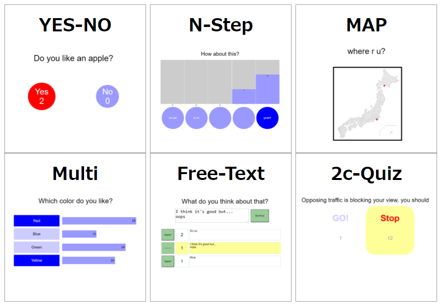

# volavote new version released

re-archtecture new version volavote 2 is [shyamagu/volavote2](https://github.com/shyamagu/volavote2 "volavote")

## volavote

you can reate 6 type of online polls using volavote.

please use Docker image [shyamagu/volavote](https://hub.docker.com/r/shyamagu/volavote "volavote") in DockerHub, and deploy to your favorite platform.

